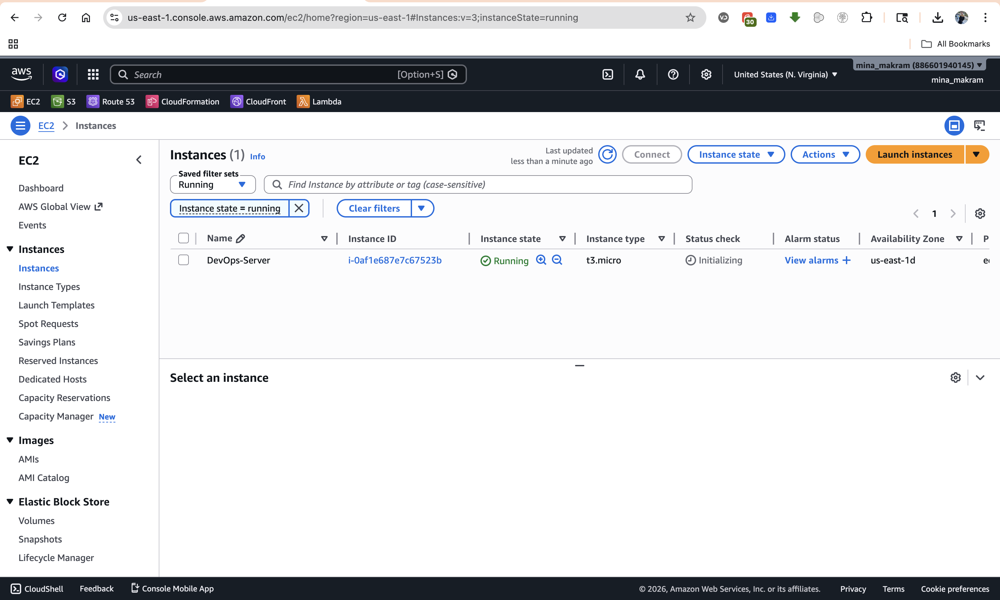
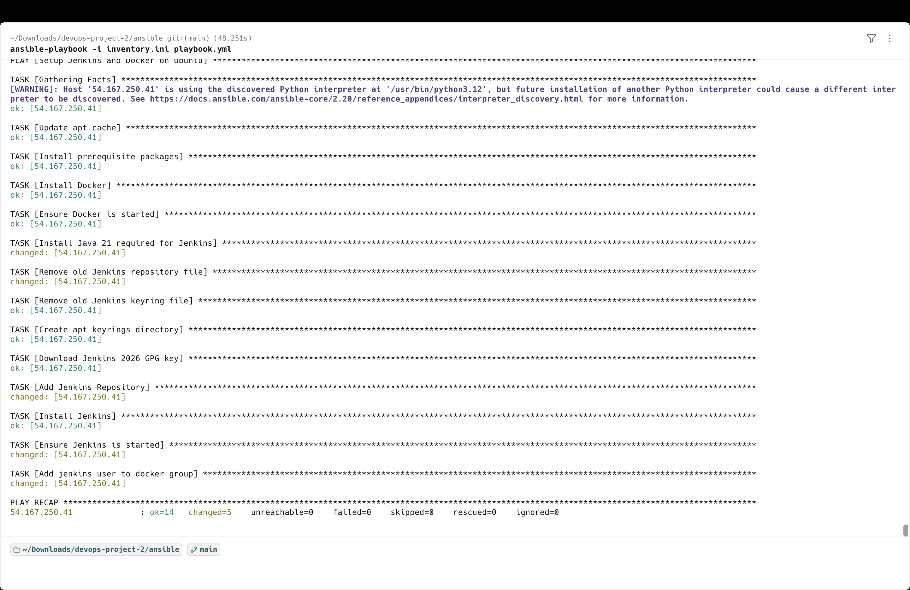
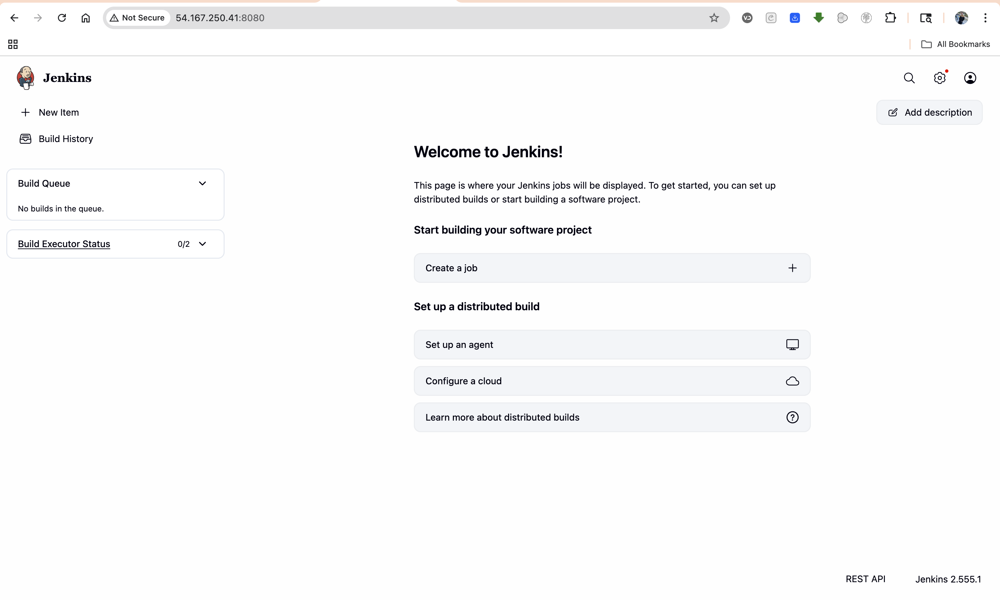
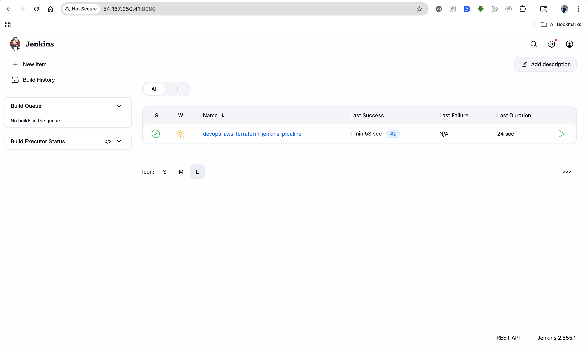
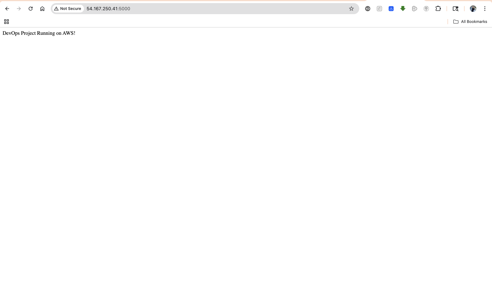

# 🚀 DevOps Project 2: AWS + Terraform + Ansible + Jenkins CI/CD Pipeline

---

## 📌 Overview

This project demonstrates a complete end-to-end DevOps pipeline on AWS.

It automates infrastructure provisioning, server configuration, and application deployment using modern DevOps tools.

The pipeline provisions an EC2 instance using Terraform, configures it with Ansible (Docker & Jenkins), and deploys a Dockerized Flask application using Jenkins CI/CD.

---

## 🛠️ Tools & Technologies

* AWS EC2
* Terraform (Infrastructure as Code)
* Ansible (Configuration Management)
* Jenkins (CI/CD Automation)
* Docker (Containerization)
* Python Flask
* Git & GitHub

---

## 🧠 Architecture Workflow

1. Terraform provisions EC2 instance on AWS
2. Ansible installs Docker and Jenkins
3. Jenkins pulls code from GitHub
4. Jenkins builds Docker image
5. Jenkins runs container
6. Application is deployed on EC2

---

## 📂 Project Structure

```
devops-aws-terraform-jenkins-pipeline/
│
├── terraform/
│   └── main.tf
│
├── ansible/
│   ├── inventory.ini
│   └── playbook.yml
│
├── jenkins/
│   └── Jenkinsfile
│
├── app/
│   ├── app.py
│   ├── Dockerfile
│   └── requirements.txt
│
├── images/
│   └── screenshots
│
└── README.md
```

---

## ⚙️ Step-by-Step Implementation

### 1️⃣ Provision Infrastructure (Terraform)

```bash
cd terraform
terraform init
terraform apply
```

---

### 2️⃣ Configure Server (Ansible)

```bash
cd ansible
ansible-playbook -i inventory.ini playbook.yml
```

---

### 3️⃣ Access Jenkins

Open in browser:

```
http://<EC2_PUBLIC_IP>:8080
```

Unlock Jenkins:

```bash
sudo cat /var/lib/jenkins/secrets/initialAdminPassword
```

---

### 4️⃣ Run Jenkins Pipeline

Pipeline stages:

* Clone repository
* Build Docker image
* Run container
* Deploy application

---

### 5️⃣ Access Application

```
http://<EC2_PUBLIC_IP>:5000
```

---

## 📸 Screenshots

### EC2 Instance



### Ansible Execution



### Jenkins Dashboard



### Jenkins Pipeline Success



### Application Running



---

## 🔐 Security & Best Practices

* AWS credentials configured using AWS CLI
* No secrets stored in code
* Private key secured using `chmod 400`
* `.gitignore` excludes sensitive files:

  * `.terraform/`
  * `*.tfstate`
  * `*.pem`

---

## 🧪 Useful Commands

### SSH into EC2

```bash
ssh -i ~/.ssh/devops-key.pem ec2-user@<EC2_PUBLIC_IP>
```

---

### Check Jenkins Status

```bash
sudo systemctl status jenkins
```

---

### Check Docker Containers

```bash
docker ps
```

---

### View Container Logs

```bash
docker logs flask-app
```

---

## 🎯 Key Learnings

* Infrastructure provisioning using Terraform
* Server automation using Ansible
* CI/CD pipeline using Jenkins
* Containerization using Docker
* End-to-end DevOps workflow on AWS

---

## 🚀 Future Improvements

* Deploy application using Kubernetes (EKS)
* Add Load Balancer
* Integrate monitoring (Prometheus & Grafana)
* Implement GitOps (ArgoCD)

---

## 👨‍💻 Author

Mina Bisa

GitHub: https://github.com/minabisa
LinkedIn: https://linkedin.com/in/mina-bisa

---

## ⭐ Support

If you like this project, give it a ⭐ on GitHub!
